# Election_Analysis
Analysis of election data using Python

## Project Analysis
A Colorado Board of Elections employee has given you the following tasks to complete the election audit of a recent local congressional election.

1. Calculate the total number of votes cast.
2. Get a complete list of candidates who received votes.
3. Calculate the total number of votes each candidate received.
4. Calculate the percentage of votes each candidate won.
5. Determine the winner of the election based on popular vote.

## Resources
- Data Source: election_results.csv
- Software: Python 3.6.1, Visual Studio Code, 1.38.1

## Summary
The analyses of the election show that:
- There were 369,711 votes cast in the election.
- The candidates were:
    - Charles Casper Stockham
    - Diana DeGette
    - Raymon Anthony Doane
- The candidate results were:
    - Charles Casper Stockham received 23.0% of the vote and 85,213 votes.
    - Diana DeGette received 73.8% of the vote and 272,892 votes.
    - Raymon Anthony Doane received 3.1% of the vote and 11,606 votes.
- The winner of the election was:
    - Diana DeGette, who received 73.8% of the vote and 272,892 votes.

## Overview of Election Audit

For this challenge, I assisted a Colorado Board of Elections employee, Tom, with an audit of the tabulated results of a U.S. Congressional district election in Colorado. I used Python to calculate the total number of votes cast, the number of votes each candidate received and his/her corresponding percentage of votes cast, and determined the election winner based upon the popular vote. Tom’s manager was looking to have me automate the audit process so that it can be used in the future to audit senatorial and local precinct elections. Ultimately, I was tasked with generating a vote count report to certify the results of the U.S. Congressional district election.

## Election-Audit Results

* A total of 369,711 votes were cast in this congressional election. In Images 1-3 illustrate the Python code used to generate the total number of votes cast. In Image 1, I added dependencies csv and os. I then assigned a variable to load the election_results.csv file. I also assigned a variable to election_analysis.txt, which I used to print the election results. Lastly in Image 1, I initialized a total vote counter and set it equal to zero. Image 2 illustrates the Python code that I used to open the CSV file and read the data contained within it. I then initiated a for loop to increment the total vote count by one for every row within the CSV file. Image 3 shows the Python commands that I used to print the election results to election_analysis.txt. Finally, Image 4 shows the election results that printed to election_analysis.txt.

* In order to calculate the number of votes cast in each county in the precinct, I began by creating a county list and county votes dictionary (Image 5). From there, I used the “with open” function to read the election data from the election_results.csv file (Image 6). Next, I used a for loop to extract information from each row in the CSV file, e.g. county name. Then, using an if statement, I added the counties to the empty county_options list and began tracking the vote count for each county using county_votes dictionary (Image 7). In Image 8, I retrieved the vote count for each county then used that figure along with the total votes cast in the election to calculate the results for each county. I then saved the county votes to a text file; the number of votes for each county is printed to election_analysis.txt (Image 9). 

* Based on the calculations in Image 10 and the printed results in Image 9, one can see that Denver county had the greatest number of votes, with 306,055 total votes.

* Again, in Image 11, I used the “with open” function to read the results tabulated in the CSV file. Using a for loop, the number of total votes was incremented by 1 for each row in the file. The candidate name was also extracted from each row and added to the candidate_options list. One can see in Image 12 that a candidate_votes dictionary was also created. Next, Image 13 shows how the candidate_votes voter count is incremented by 1 each time a candidate’s name appears in a row. Looking at Image 14, one can see that each candidate’s votes were divided by the total votes cast in the election in order to calculate his/her share of the vote. Each candidate’s results were then printed to a txt file. In this case, Charles Casper Stockham won 23.0% of the total vote, having received 85,213 votes; Diana DeGette won 73.8% of the total vote, with 272,892 votes; while Raymon Anthony Doane won 3.1% of the total vote, having received 11,606 votes (Image 15).

* In the end, one can see in Image 15 that Diana DeGette won the election, having received the greatest share of the vote at 73.8% of the vote, corresponding to 272,892 votes out of 369,711 total votes cast. (The winner was calculated by comparing the number of votes each candidate received to the winning county. If the candidate’s votes were greater than the winning_count and the vote_percentage greater than the winning_percentage, the candidate was declared the winning_candidate (Image 14).)

## Election-Audit Summary

An audit of a U.S. Congressional district election in Colorado was successfully completed using Python scripting to automate much of the process. Given a .csv file with raw election data, I developed a program to read the results, perform calculations based upon the data retrieved from said file, and determine the winner of the election. This program could be used in the future to audit a variety of elections, from U.S. senatorial elections down to the local level. By simply providing the raw data in a CSV format, the Python scripting can account for any number of candidates and counties to accurately determine the winner of the election. Besides determine the winner, the program determines how many candidates received votes as well as their percentage of the total vote. For example, a U.S. senatorial election involves determining how many candidates received votes within each senate district. Instead of determining the total number of votes per county, the vote count can be broken down by district. With this information, the winner of the election can then be determined. In the case of a local, county election, the results can be tabulated by precinct or voting station and the winner determined.

## Images
##### Image 1
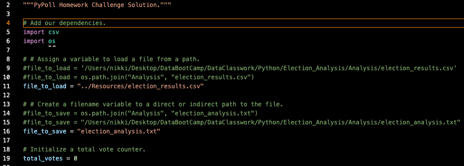

##### Image 2
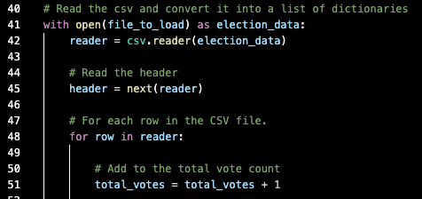

##### Image 3
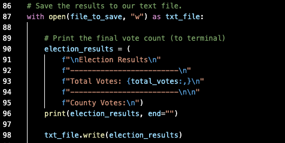

##### Image 4
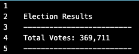

##### Image 5
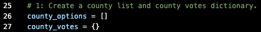

##### Image 6
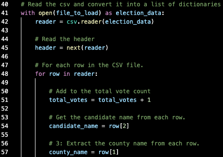

##### Image 7
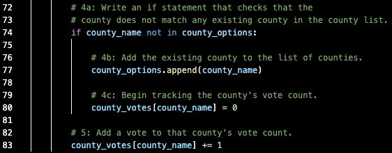

##### Image 8
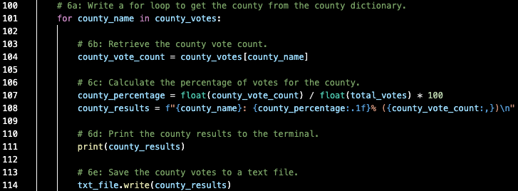

##### Image 9
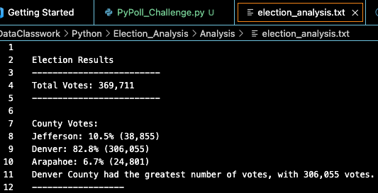

##### Image 10
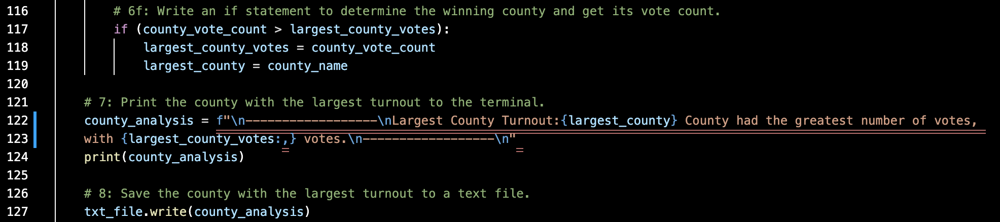

##### Image 11
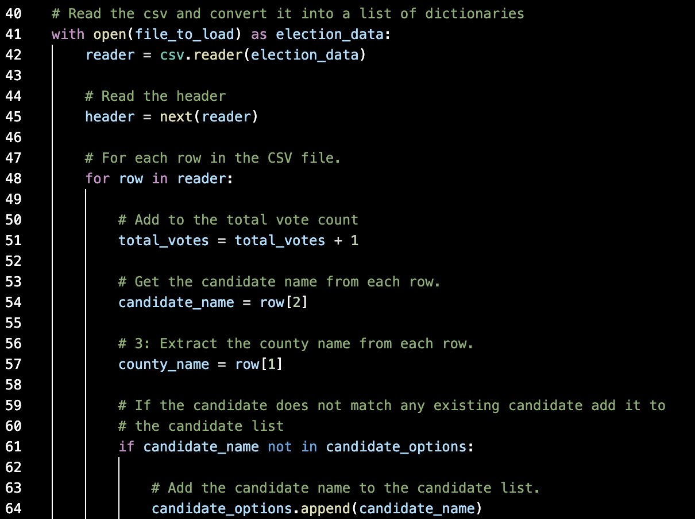

##### Image 12
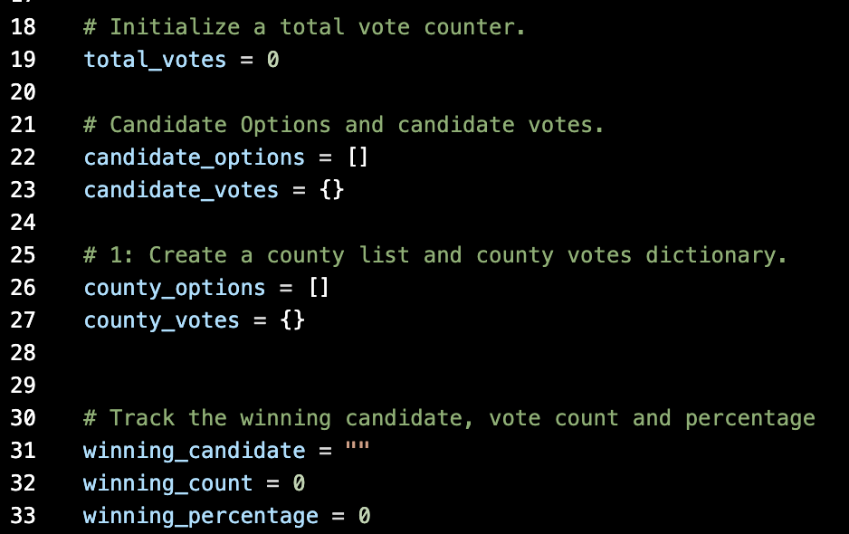

##### Image 13
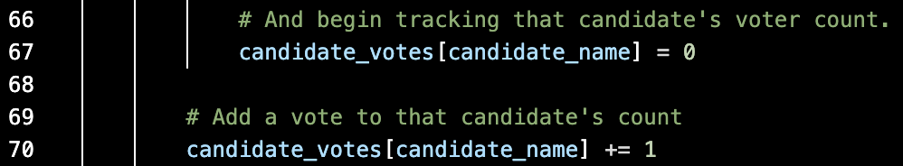

##### Image 14
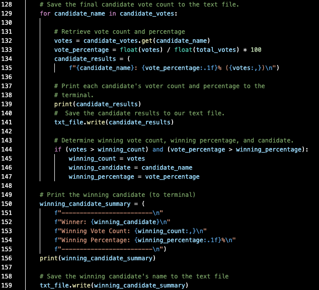

##### Image 15
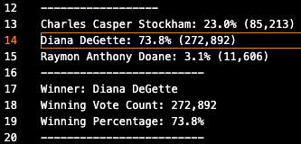
